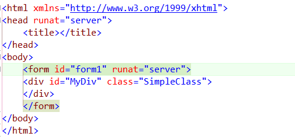

CR_AttributeTabber
==================

This plugin allows you to use those Tab to Next Reference skills to navigate between the attributes of a HTML or XML tag (including their values)

Usage

Simply place your caret on an HTML\XML Attribute, and hit either Tab or Shift+Tab to navigate as usual. 
